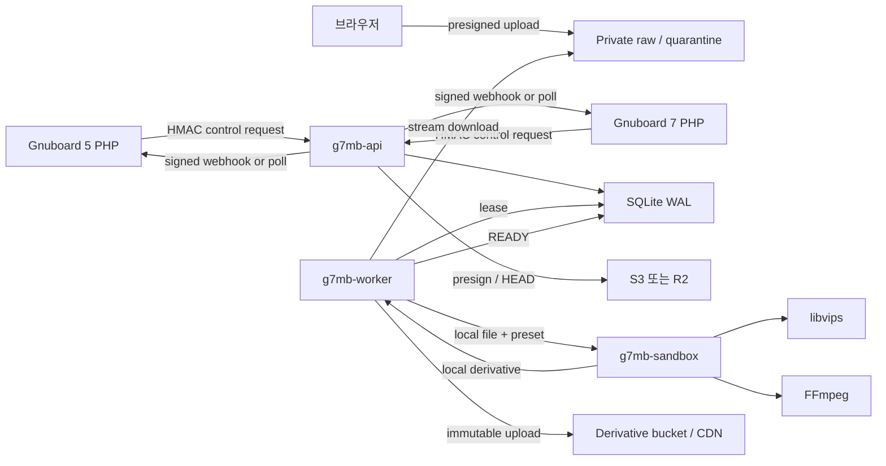

# 아키텍처

## 처리 경계



핵심 보안 경계는 Rust와 C의 언어 경계가 아니라 **API/worker/sandbox의 프로세스와 권한
경계**입니다. libvips와 FFmpeg가 손상되어도 API 자격 증명과 PHP 세션으로 이동할 수 없어야
합니다.

## Cargo 의존 방향

```text
g7mb-domain
    ^
g7mb-contracts   g7mb-application
                       ^
       +---------------+------------------+
       |               |                  |
 g7mb-auth    g7mb-object-store-s3   g7mb-media
                       |                  |
              g7mb-persistence-sqlite    |
                       ^                  ^
                       +--------+---------+
                                |
                  api / worker / sandbox
```

- domain은 외부 I/O를 모릅니다.
- application port는 특정 SDK type을 노출하지 않습니다.
- native type은 `g7mb-media` 밖으로 새지 않습니다.
- 앱 crate는 조립과 lifecycle만 담당합니다.

## 배포 단위

v1 단일 노드 배포는 다음 세 systemd service를 권장합니다.

- `g7mb-api.service`: loopback/private bind, outbound S3/R2 허용
- `g7mb-worker.service`: SQLite, raw/derivative storage 권한, sandbox 호출 권한
- `g7mb-sandbox` 격리 child: Linux seccomp socket syscall 차단, 임시 디렉터리만 쓰기

SQLite 파일은 로컬 영구 디스크에 두고 WAL checkpoint와 백업을 운영합니다. NFS에 두지
않습니다. 수평 확장이 필요하면 queue/persistence port를 PostgreSQL 또는 Redis 기반으로
교체하는 ADR을 먼저 작성합니다.

## 동시성 모델

- API: async I/O, 전역 요청 동시성 제한
- worker: bounded lease 수와 bounded local download 수
- sandbox: 작업 단위 프로세스 또는 고정 소수 프로세스
- libvips: 한 sandbox 안에서 자체 thread pool 사용
- FFmpeg: 명시적 thread 제한

기본값은 `sandbox_processes * native_threads <= allocated_cpu_cores`입니다. AVIF는 별도
semaphore를 가져 일반 JPEG/WebP latency를 밀어내지 않게 합니다.

## 신뢰할 수 있는 완료 순서

파생물을 먼저 임시 key에 업로드하고 digest/크기를 확인한 뒤 최종 불변 key로 게시합니다.
DB의 `READY`는 최종 object가 확인된 뒤에만 기록합니다. 웹훅 실패는 미디어 작업 성공을
되돌리지 않으며 별도 delivery retry로 처리합니다.
