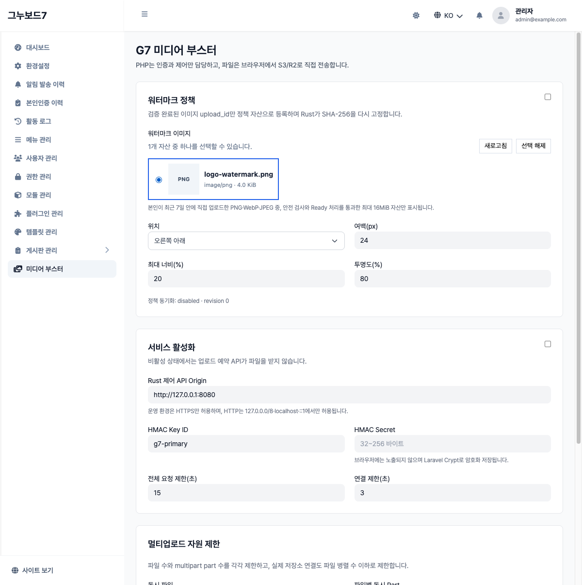

# G7 워터마크 선택기·권한 매트릭스 증거

- 실행일: 2026-07-16
- G7 기준: `e64381ddb5ba02caed60933427fbb86ef72ef94e`
- 모듈: `jiwonpapa-g7mediabooster` 0.4.0
- 환경: PHP 8.5.3, MySQL 8.4.10, `sirsoft-board` 1.2.0, upstream patch `0001`~`0005`

## 관리자 워터마크 선택기

실제 G7 관리자 브라우저에서 다음 순서를 확인했습니다.

1. 현재 관리자가 최근 7일 안에 올린 Ready PNG·WebP·JPEG만 목록에 표시
2. session·native attachment 소유권 불일치, 잘못된 collection, 삭제 대기, Ready 이전,
   AVIF, 16MiB 초과 자산 제외
3. 자산 선택 후 설정 저장, 페이지 재로드 뒤 같은 UUID 선택 상태 유지
4. 선택 해제 후 저장, 페이지 재로드 뒤 빈 상태 유지
5. 브라우저에는 object key·로컬 경로·HMAC secret을 노출하지 않음

인증 Bearer header를 붙일 수 없는 일반 `` 요청을 피하기 위해 선택기는 원본·파생물
미리보기를 직접 요청하지 않습니다. 검증된 format, filename, MIME, encoded size만 정적 카드로
표시합니다.

호스트 DB 게이트는 7 tests/38 assertions를 통과했고, 이 중 catalog 테스트가 current-admin,
Ready, 형식, 크기, 삭제 상태 경계를 실제 G7 model과 DB로 검증합니다. 설정 저장 API도 catalog에
없는 UUID를 `422`로 거부합니다.

## 실브라우저 첨부 권한 매트릭스

Rust API를 의도적으로 비활성화한 상태에서 G7 권한 guard까지만 검증했습니다. `503`은 권한을
통과해 upstream 호출 단계까지 도달했다는 뜻이고, `403`은 upstream 호출 전에 G7이 차단한
것입니다.

| 브라우저 사용자 | 공개글 | 본인 비밀글 | 타인 블라인드글 | 삭제글 |
|---|---:|---:|---:|---:|
| 작성자 | upstream 도달 (`503`) | upstream 도달 (`503`) | upstream 도달 (`503`) | `403` |
| 다른 회원 | upstream 도달 (`503`) | `403` | `403` | `403` |
| 비회원 | upstream 도달 (`503`) | `403` | `403` | `403` |
| 관리자 | upstream 도달 (`503`) | upstream 도달 (`503`) | upstream 도달 (`503`) | upstream 도달 (`503`) |

허용 경로의 실제 private object `302`→MinIO `200` 전달은
[`G7_STORAGE_E2E_20260716.md`](G7_STORAGE_E2E_20260716.md)에서 별도로 검증했습니다.

## 판정

G7 0.4.0의 관리자 자산 선택·저장·rollback과 실브라우저 권한 차단은 PASS입니다. 이 증거는
실 R2/Lightsail 전송, 5GiB multipart 또는 보존 command의 실 provider 삭제를 승격하지 않습니다.
